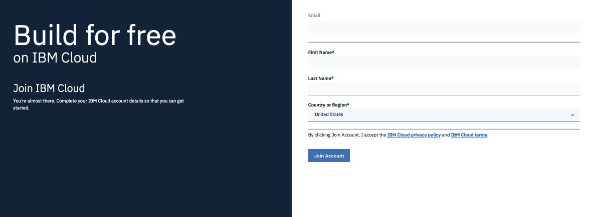

# Setup

For this workshop, you received an IBM Cloud email. 

## Register with Existing IBM Cloud Account

If your email was already associated with an IBM Cloud account, you received an `User account changed` email from IBMid.

* Click the `Sign into My IBM` link,
* Log in to IBM,
* Click `Continue`,
* Enter password and click `Login`,
* Click the `Launch` button in the `IBM Cloud [Pay-As-You-Go] window,

## Register - New to IBM Cloud

If your SSO email was not priorly associated with an IBM Cloud account, you received a `You are invitated to join` email from IBMid. 

Next:
* Click the `Join now` link,

* Click `Join acount`,

* Click `Log in`,

## Get Started Email

In preparation for the workshop, each participant also received a `Getting Started` email with information needed to run this workshop and unique for each participant including:

* Your Web Terminal URL,
* Your IKS Cluster Name,
* Your Event Streams Service Name.

1. Open a browser and load your unique `Web Terminal URL` assigned to you,
2. 